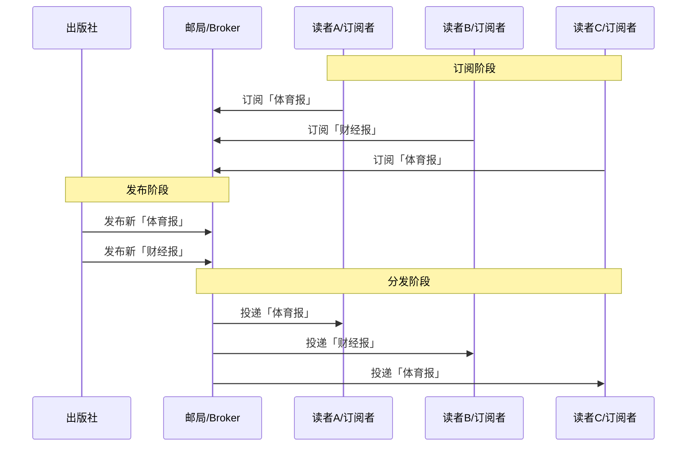
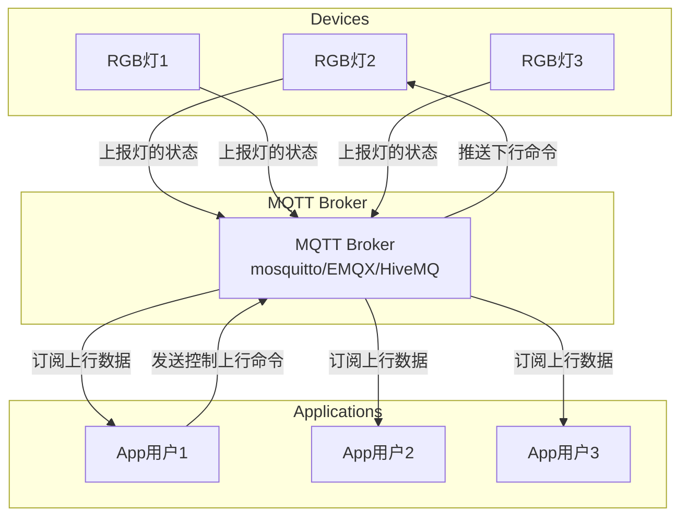
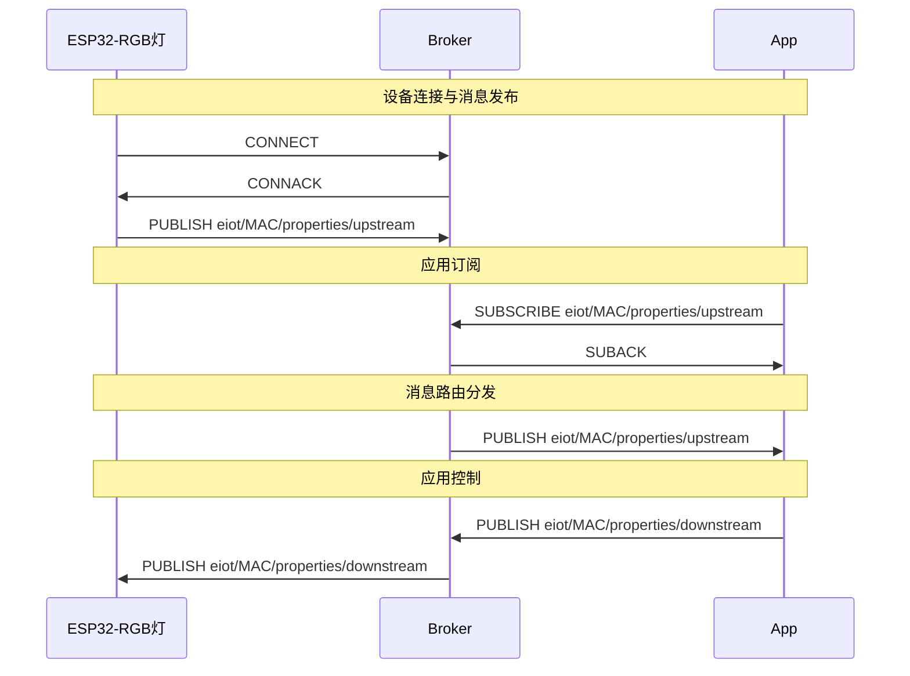

## 1. 初衷

最近在给一所大专3年级的同学上安卓开发课程，同学们以前所学的课程以嵌入式开发为主，对于软件开发可能不太熟悉，而且同学们也即将开始毕业设计，出于毕业设计启发的目的，本系列文章将带着大家从0开始搭建属于一个**手机APP控制RGB灯**的项目。希望本系列文章可以给同学们一些点子与启示。

本系列将以3篇文章，分别介绍项目涉及的**理论知识**、**嵌入式单片机的实现**、**安卓APP的实现**这3个部分，详细讲解如何从0开始去构建一个完整的项目。

## 2. 项目成果演示


## 3. 适用人群

本科或大专同学，希望学习物联网相关知识的同学和电子/软件开发爱好者。此篇比较基础，如果有相关经验的可以直接跳过相关章节。

## 4. 入门知识

### 4.1 MQTT协议入门

由于需要实现远程控制，本教程适用物联网领域非常流行的MQTT通信协议，实现基于消息订阅的设备控制系统。

MQTT是一个基于发布/订阅模式的轻量级的基于TCP的通信协议。由于其轻量化的特性，MQTT被广泛应用于物联网设备的传输。

#### 4.1.1 发布/订阅模式

MQTT的核心是消息的发布和订阅，那何为发布/订阅模式呢？我们以生活中常见的订阅报纸的模式来简要描述该模式。

例如有些读者喜欢了解时事新闻，有些读者喜欢大山大河的地理风光，假如这些读者通过邮局去订阅了各自喜好的杂志。

因为杂志会有成百上千种，而读者可能只喜欢订阅其中某几本杂志，所以在邮局里面，邮局需要注册读者A订阅的是哪几本杂志，读者B定也的是哪几本，有了这个映射关系后，当有新的杂志发行，邮局就可以根据订阅关系投递到对应的读者手上。

这里会涉及到如下几个角色：

* 杂志，印刷和承载了不同的内容，包括风光杂志、时事杂志等。（**主题**）
* 出版社，负责编写和印刷不同种类的杂志。（**发布者**）
* 邮局，负责接收来自出版社出版的最新的杂志，并投递杂志到相关的读者家里。（**消息中心Broker**）
* 读者，杂志的订阅者，读者可以根据自己的喜好，订阅不同的杂志。（**订阅者**）



#### 4.1.2 MQTT核心概念

在物联网中，MQTT协议就像杂志订阅例子一样，消息由设备产生，而我们的APP就像读者，设备有成千上万个，而我们某个用户的APP可能只关心自己的几个设备，所以读者可以通过Broker订阅特定设备的消息主题。

##### MQTT的基本模型

* 发布/订阅模式：消息发送者（发布者）和接收者（订阅者）解耦
* 主题(Topic)：消息的分类通道，如 sensor/temperature
* Broker：消息代理服务器，负责路由消息

##### 三个角色

* 发布者(Publisher) - 发送消息的设备
* 代理(Broker) - 消息中转服务器
* 订阅者(Subscriber) - 接收消息的应用

##### 消息质量等级QoS

因为网络的不可靠性，MQTT为消息定义了不同的消息质量等级，我们可以根据消息的重要性来选择不同的QoS等级。

| 特性 | QoS 0 | QoS 1 | QoS 2 |
|------|-------|-------|-------|
| **中文名** | 最多一次 | 至少一次 | 刚好一次 |
| **保证送达** | ❌ 不保证 | ✅ 保证 | ✅ 保证 |
| **重复消息** | ❌ 不会重复 | ⚠️ 可能重复 | ✅ 不会重复 |
| **传输次数** | 1次 | ≥2次 | 4次 |
| **性能** | 🚀 最快 | 🚗 中等 | 🐢 最慢 |
| **可靠性** | ⭐ 低 | ⭐⭐ 中 | ⭐⭐⭐ 高 |
| **网络开销** | 最小 | 中等 | 最大 |
| **类比** | 寄平信 | 寄挂号信 | 快递签收 |
| **适用场景** | 温度传感器<br>实时位置 | 设备控制<br>状态更新 | 支付指令<br>关键配置 |

- **QoS 0**: 可容忍数据丢失的实时监测
- **QoS 1**: 需要可靠送达的控制指令  
- **QoS 2**: 不能丢失也不能重复的关键业务

##### 消息主题

主题就是消息的收件地址，Broker根据地址精准投递给订阅了该地址的订阅者。

* 分层结构，用/分隔，如`home/livingroom/temperature`
* 通配符，主题支持通配符
  - **+**：单级匹配 `home/+/temperature`
  - **#**：多级匹配 `home/#`
* 订阅过滤，订阅者只收到匹配主题的消息

例如，使用主题来描述不同城市的天气状况，主题格式: 

* 天气预报：`省份或直辖市自治区/城市/forecast`
* PM2.5：`省份或直辖市自治区/城市/pm25`
* 空气质量：`省份或直辖市自治区/城市/air-quality`

假如有如下场景:

1. 用户A只关心北京的天气，那么用户A可以订阅北京的天气预报消息主题：`beijing/beijing/forecast`
2. 用户B关心整个广东的PM2.5，那么用户B可以使用通配符，订阅整个广东的天气消息：`guangdong/+/pm25`
3. 用户C关心整个广东的天气预报，PM2.5，空气质量，那么用户C可以使用通配符，订阅整个广东的天气消息：`guangdong/#`

#### 4.1.3 MQTT版本对比

MQTT被广泛应用的版本主要是 **v3.1.1** (2014年发布) 和 **v5.0** (2019年发布)，
* v3.1.1 是一个稳定、久经考验的基准协议，功能完善，但错误处理和会话管理较为简单；
* v5.0 是面向未来、功能更强大的协议，它解决了 v3.1.1 在大规模部署和复杂场景中所面临的痛点。

| 特性 | MQTT v3.1.1 | MQTT v5.0 | v5.0 版本带来的好处 |
| :--- | :--- | :--- | :--- |
| **错误报告** | 仅有有限的连接状态返回码。 | 在所有确认（ACK）数据包中都有 **原因码 (Reason Codes)**。 | **更便捷的调试**，以及在连接、发布和订阅过程中能更精确地识别失败原因。 |
| **会话管理** | 使用 **Clean Session** 标志；会话要么永久存在，要么完全不存在。 | 使用 **Clean Start** 标志和 **会话过期间隔 (Session Expiry Interval)**。 | 允许客户端指定断开连接后 Broker 应保留其会话数据的时间，从而节省资源并改善资源管理。 |
| **元数据与上下文** | 仅限于固定头部。 | 在消息头部中包含**用户属性 (User Properties)**（自定义键值对）。 | 允许将**特定于应用的元数据**（例如：时间戳、位置）附加到消息中，而无需修改消息体 (Payload)。 |
| **主题处理** | PUBLISH 数据包中每次都包含主题名称。 | **主题别名 (Topic Aliases)** 可以用较短的数字 ID 替换冗长的主题名称。 | **减少网络开销**并节省带宽，尤其是在频繁发布长主题时。 |
| **负载均衡** | 不支持原生功能；所有订阅者接收所有消息。 | **共享订阅 (Shared Subscriptions)**（`$share/...`）。 | 允许多个客户端共享一个订阅，并对传入消息进行负载均衡，从而提高后端处理的**可扩展性**。 |
| **消息生命周期** | 没有消息过期机制。 | **消息过期间隔 (Message Expiry Interval)**。 | 如果消息未在设定的时间内送达，它将被丢弃，防止客户端重新连接时收到陈旧或不相关的旧数据。 |
| **通信模式** | 仅支持发布/订阅模式。 | 使用 **响应主题 (Response Topic)** 和 **关联数据 (Correlation Data)** 属性来正式支持**请求/响应模式**。 | 正式确立了一种常见的交互模式，使指令和控制操作更简单、更可靠。 |

### 4.2 JSON数据格式入门

我们了解了MQTT协议的一些基本概念后，我们将要学习具体的**数据传输格式**。因为MQTT并未规定每个消息主题的消息内容是以什么数据格式传输，这个需要有应用开发者自行制定。

我们这个系列将以互联网中非常流行，且简单易于理解的JSON数据格式作为RGB灯光控制指令的编码格式。

#### 4.2.1 JSON是什么

JSON (Javascript Object Notation) 是一个文本编码格式，可以无需借助特殊工具，即可让人类阅读和修改。JSON最初是在javascript语言中流行，后来由于其轻量性和可阅读性，被广泛应用于不同的语言中，在服务器API中也被广泛支持。

#### 4.2.2 JSON的格式规范

1. 键值对 (Key-Value Pairs)

```json
{
  "name": "张三",
  "age": 25,
  "isStudent": false
}
```

2. 值的数据类型

    * 字符串："hello"（必须双引号）
    * 数字：123、12.34
    * 布尔值：true、false
    * null：null
    * 对象：{ ... }
    * 数组：[ ... ]

#### 4.2.3 JSON对象

用花括号 `{}` 包裹，包含键值对：

```json
{
  "firstName": "李",
  "lastName": "四",
  "address": {
    "city": "北京",
    "street": "长安街"
  }
}
```

#### 4.2.4 JSON数组

用方括号 [] 包裹，包含有序的值列表：

```json
["苹果", "香蕉", "橙子"]
```

#### 4.2.5 JSON完整示例

```json
{
  "students": [
    {
      "id": 1,
      "name": "小明",
      "courses": ["数学", "英语"],
      "scores": {
        "数学": 95,
        "英语": 88
      }
    },
    {
      "id": 2,
      "name": "小红",
      "courses": ["语文", "物理"]
    }
  ],
  "totalCount": 2
}
```

## 5. 系统架构

所谓高屋建瓴，有了以上的知识储备后，我们从宏观的角度来看看我们的系统是由哪几个部分组成，然后我们就可以以庖丁解牛的方式，逐个组件去实现，最后集成并进行调试。

### 5.1 系统架构图

系统架构总览请看下图:



系统分为3个组件

#### 5.1.1 MQTT Broker

出于实验的目的，我们这里使用公开的mqtt broker作为本项目的消息交换中心，公开的无需授权即可接入的broker包括:

* EMQX, **broker.emqx.io**, TCP端口:1883, WebSocket端口: 8083
* Mosquitto, **test.mosquitto.org**, TCP端口: 1883, WebSocket端口: 8080
* HiveMQ, **broker.hivemq.com**, TCP端口: 1883, WebSocket端口: 8000

> ⚠️ 注意： 以上公开的broker只作为实验用途，切勿用于生产环境哦

#### 5.1.2 设备端

设备端使用的是ESP32S3开发板, 某宝上非常多，可以选择合适的购买，规格购买: ESP32-S3-8R2开发板(焊接)，需要留意的是，需要购买带**WS2812 RGB灯**的开发板哦，样品如下图所示：


设备端软件，我们使用的是Platformio的Arduino环境，简化开发难度。后续系列文章将详细介绍如何搭建与开发设备端的程序，敬请关注。

#### 5.1.3 APP端

APP端我打算先介绍如何使用原生安卓开发一个MQTT客户端，后续会出系列文章介绍如何使用flutter和iOS原生来开发APP侧的应用，敬请期待。

#### 5.1.4 通信协议

本项目使用如下主题实现双向通信

* 设备上行: `eiot/<MAC地址>/properties/upstream`，其中MAC地址通过程序获取，每个模组不一样。
* 设备下行: `eiot/<MAC地址>/properties/downstream`

主题的payload使用**json**编码，数据格式如下：

| 字段属性 | 类型 | 描述 |
| --- | --- | --- |
| command | 字符串 | 指令类型，目前固定为light, 表示灯属性 |
| payload | 对象 | 控制的参数 |
| payload.i | 数字 | 控制第几个LED，目前固定为0 |
| payload.r | 数字 | RGB的红色值，0～255 |
| payload.g | 数字 | RGB的绿色值，0～255 |
| payload.b | 数字 | RGB的蓝色值，0～255 |
| payload.a | 数字 | 灯的亮度，0～255 |

参考示例：

```json
{
    "command": "light",
    "payload": { 
        "r": 96, 
        "b": 255, 
        "g": 0, 
        "i": 0, 
        "a": 100 
    }
}
```

上述指令表示，设置灯的颜色为`R = 96, B = 255, G = 0`，亮度设置为`100`

### 5.2 MQTT时序图

本项目的各个组件的交互流程如下图所示，本项目使用的是EMQX的broker：`broker.emqx.io`



#### 5.2.1 设备端流程

1. 搜索预先设置的Wi-Fi路由器，并尝试连接
2. 连接上网络后，发起MQTT连接
3. 连接上broker后，订阅下行数据主题`eiot/<MAC地址>/properties/downstream`，注意，每个模组的mac都不一样哦
4. 接收到下行数据主题后，调用FastLED库控制WS2818灯

#### 5.2.2 APP端流程

1. 用户可以通过APP设置需要订阅的设备的MAC
2. 实现一个色彩环Picker，用户可以选择自己喜欢的颜色
3. 连接mqtt broker
4. 订阅设备上行数据主题: `eiot/<MAC地址>/properties/upstream`
5. 用户选择色环的颜色后，发布下行数据主题：`eiot/<MAC地址>/properties/downstream`

## 6. 参考文献

* [MQTT Version 3.1.1 Plus Errata 01, https://docs.oasis-open.org/mqtt/mqtt/v3.1.1/mqtt-v3.1.1.html](https://docs.oasis-open.org/mqtt/mqtt/v3.1.1/mqtt-v3.1.1.html)
* [MQTT Version 5.0, https://docs.oasis-open.org/mqtt/mqtt/v5.0/mqtt-v5.0.html](https://docs.oasis-open.org/mqtt/mqtt/v5.0/mqtt-v5.0.html)
* [JSON Schema and Hyper-Schema. json-schema.org](json-schema.org)

