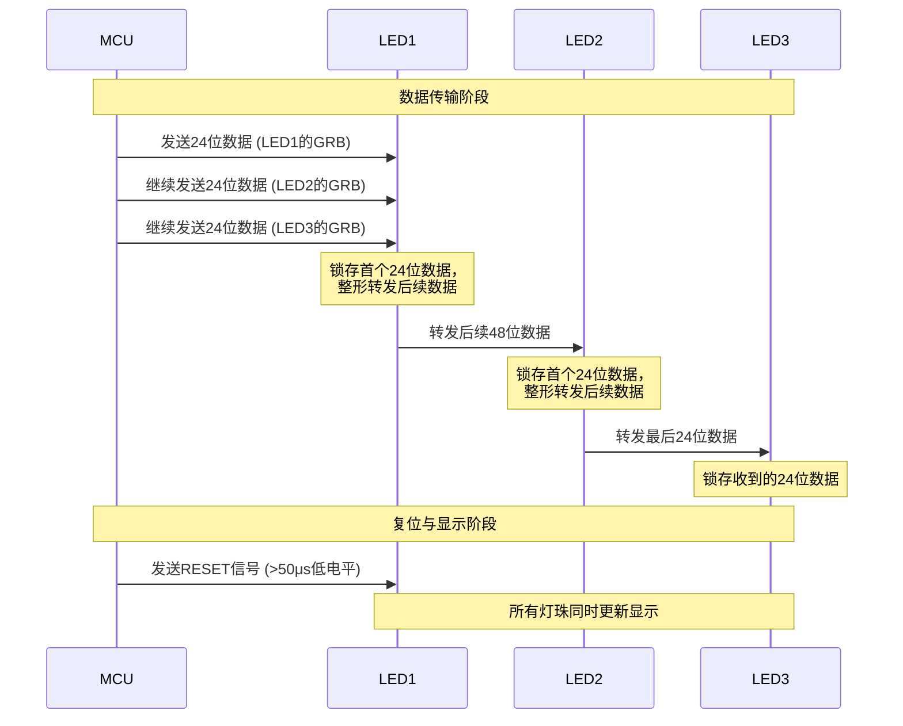

## 1. 准备材料

本文是《基于MQTT实现RGB灯远程控制》的第二篇，基于ESP32-S3开发板实现RGB灯的下位机。

## 2. 开发环境搭建

本项目使用的是vscode + Platformio作为开发环境，所以在开始开发前需要安装vscode，并安装platformio插件。

### 2.1 vscode

vscode是由微软开发的ide工具，基于plugin系统实现支持多种开发语言开发项目，另外由于其入门简单，在前端开发中非常流行。本项目我们也使用vscode来作为我们的开发环境。vscode的下载地址如下：

https://code.visualstudio.com/

### 2.2 platformio插件

#### 2.2.1 platformio的介绍

platformIO 是一个专业的、开源的、跨平台的物联网（IoT）开发生态系统。它不是一个独立的软件，而是一个核心工具，最常以插件的形式集成到现代代码编辑器中使用，例如 Visual Studio Code 和 Atom。

platformio拥有如下优势：
1. **跨平台支持**，操作系统：完美支持 Windows, macOS, Linux。你再也不用为开发环境的不同而烦恼。支持超过 50 种开发平台，超过 3500 个开发板。从常见的 Arduino UNO、ESP32、ESP8266、Raspberry Pi Pico，到专业的 STM32、Nordic nRF 等，几乎无所不包。
2. **强大的库管理**，内置库管理器：拥有一个庞大的官方库注册中心，你可以轻松搜索、安装和管理项目依赖的库。
3. **统一的构建系统**， 无论你使用哪种开发板，编译命令都是统一的 pio run。
4. **无缝的调试功能**， 提供了强大的、一体化的调试体验。你可以在 VS Code 中直接设置断点、单步执行、查看变量和内存，无需借助其他独立的调试工具。

#### 2.2.2 platformio插件的安装

打开vscode的插件管理界面，搜索`platformio`，找到platformio插件后，点击`install`安装即可：


## 3. 创建项目

安装好了vscode和platformio插件后，我们可以通过platformio的界面创建一个项目，步骤如下：


1. 打开platformio的界面。
2. 打开PIO Home后，点击右上角的"New Project"按钮创建项目。
3. 新建项目弹框中，选择与我们项目使用的开发相近的Board: ESP32S3-R8N16 (4d_systems_esp32s3_gen4_r8n16)
    
4. 点击确认创建项目，第一次使用platformio时，它会相关的arduino框架和编译工具链，需要耐心等待其下载完毕。
5. 新建完毕后，项目的结构大概是这样，其中`src`存放的是我们的源码，`include`则存放头文件：
   ```text
    <project-name>/
    ├── .pio/             # PlatformIO 内部构建和缓存文件夹 (通常被忽略)
    ├── .vscode/          # VSCode 工作区配置文件
    │   └── settings.json # (可选) 存放项目特定的 VSCode 配置
    ├── .gitignore        # Git 忽略文件列表
    ├── include/          # 存放项目级别的头文件 (.h, .hpp)，供项目内所有源文件使用
    │   └── my_header.h
    ├── lib/              # 存放项目私有的库文件 (Local Libraries)
    │   └── MyCustomLib/
    │       ├── src/
    │       │   └── MyCustomLib.cpp
    │       └── MyCustomLib.h
    ├── src/              # 存放项目主要源代码 (.c, .cpp, .ino, .h)
    │   └── main.cpp      # 默认或主要的入口文件
    ├── test/             # 存放单元测试文件 (Unit Testing)
    │   └── test_main.cpp
    ├── platformio.ini    # !!! 核心配置文件 !!! 包含了板卡、框架、库依赖等所有项目配置
    └── README.md
    ```

### platformio.ini文件说明

platformio.ini是platformio项目的配置文件，在这里，我们可以定义项目的基础信息，`platformio.ini` 采用 INI 文件格式，主要包含以下段：

- `[platformio]` - PlatformIO 核心配置
- `[env]` - 全局环境配置（所有环境继承）
- `[env:环境名]` - 特定环境配置

#### [platformio] 段配置项

| 配置项 | 描述 | 示例值 |
|--------|------|--------|
| `default_envs` | 指定默认构建的环境 | `uno`, `nodemcu-32s` |
| `extra_configs` | 引入其他配置文件 | `extra.ini`, `debug.ini` |
| `description` | 项目描述 | `My IoT Project` |
| `homepage` | 项目主页 | `https://github.com/...` |

#### 环境核心配置项

| 配置项 | 描述 | 示例值 |
|--------|------|--------|
| `platform` | 目标平台 | `espressif32`, `ststm32`, `atmelavr` |
| `board` | 开发板型号 | `nodemcu-32s`, `uno`, `bluepill_f103c8` |
| `framework` | 开发框架 | `arduino`, `espidf`, `mbed`, `zephyr` |
| `board_build.mcu` | 指定MCU型号 | `esp32`, `stm32f103c8t6` |
| `board_build.f_cpu` | CPU频率 | `160000000L`, `72000000L` |
| `board_build.variant` | 开发板变体 | `nodemcu-32s`, `bluepill` |

#### 构建配置项

| 配置项 | 描述 | 示例值 |
|--------|------|--------|
| `build_type` | 构建类型 | `release`, `debug` |
| `build_flags` | 编译标志 | `-DDEBUG`, `-Og`, `-Wall` |
| `build_unflags` | 移除的编译标志 | `-Os`, `-std=gnu11` |
| `src_dir` | 源代码目录 | `src` |
| `lib_dir` | 库文件目录 | `lib`, `../libraries` |
| `lib_deps` | 项目依赖库 | `bblanchon/ArduinoJson`, `Wire` |
| `lib_archive` | 是否创建库归档 | `false`, `true` |
| `lib_ld_mode` | 链接模式 | `chain+`, `deep`, `off` |

#### 上传配置项

| 配置项 | 描述 | 示例值 |
|--------|------|--------|
| `upload_protocol` | 上传协议 | `serial`, `stlink`, `jlink`, `esptool` |
| `upload_port` | 上传端口 | `COM3`, `/dev/ttyUSB0` |
| `upload_speed` | 上传波特率 | `115200`, `9600` |
| `upload_flags` | 上传额外参数 | `--before=default_reset`, `--after=hard_reset` |
| `upload_command` | 自定义上传命令 | `custom_upload.py` |

#### 调试配置项

| 配置项 | 描述 | 示例值 |
|--------|------|--------|
| `debug_tool` | 调试工具 | `jlink`, `stlink`, `cmsis-dap` |
| `debug_init_break` | 启动时暂停 | `tbreak setup`, `tbreak main` |
| `debug_port` | 调试端口 | `localhost:4242` |
| `debug_speed` | 调试速度 | `5000` |
| `debug_load_mode` | 加载模式 | `always`, `modified` |

#### 串口监视器配置项

| 配置项 | 描述 | 示例值 |
|--------|------|--------|
| `monitor_speed` | 波特率 | `115200`, `9600` |
| `monitor_port` | 监视端口 | `COM3`, `/dev/ttyUSB0` |
| `monitor_dtr` | DTR控制 | `1`, `0` |
| `monitor_rts` | RTS控制 | `1`, `0` |
| `monitor_echo` | 显示回显 | `yes`, `no` |
| `monitor_raw` | 原始模式 | `yes`, `no` |
| `monitor_encoding` | 字符编码 | `utf-8`, `hexlify` |
| `monitor_filters` | 输出过滤器 | `default`, `colorize`, `send_on_enter` |

#### 网络配置项

| 配置项 | 描述 | 示例值 |
|--------|------|--------|
| `upload_port` | 网络上传端口 | `192.168.1.100:3232` |
| `debug_port` | 网络调试端口 | `192.168.1.100:4242` |
| `monitor_port` | 网络监视端口 | `192.168.1.100:23` |

#### 硬件配置项

| 配置项 | 描述 | 示例值 |
|--------|------|--------|
| `board_build.ldscript` | 链接脚本 | `eagle.flash.4m.ld`, `stm32f103c8t6.ld` |
| `board_build.f_flash` | Flash频率 | `40000000L`, `80000000L` |
| `board_build.flash_mode` | Flash模式 | `dio`, `qio`, `dout` |
| `board_upload.maximum_size` | 最大固件大小 | `1048576`, `4194304` |
| `board_upload.maximum_ram_size` | 最大RAM大小 | `32768`, `524288` |

#### 环境变量和条件配置

```ini
; 多环境配置示例
[env]
platform = espressif32
framework = arduino

[env:debug]
board = nodemcu-32s
build_type = debug
build_flags = -DDEBUG -Og

[env:release]
board = nodemcu-32s
build_type = release
build_flags = -DRELEASE -Os

; 条件配置
[env:custom]
platform = ${sys.platform}
build_flags = 
  -DVERSION=1.0.0
  -DBUILD_DATE=\"${datetime.date.today()}\"
```

## 4. 安装第三方依赖

本案例中，我们需要实现MQTT的客户端，同时需要控制WS2812B灯的颜色，platformio提供一个非常强大的依赖管理机制，可以方便开发者复用其他人开发好的第三方库。

### 4.1 platformio插件库
platformio提供一个第三方插件库的网页，我们可以通过该网页查找第三方库: [https://registry.platformio.org/](https://registry.platformio.org/)


例如我们在本项目中，需要控制WS2812B RGB灯，我们可以通过插件网页搜索`FastLED`，该插件支持非常多种类的灯的控制。


FastLED目前最新的版本为`3.10.3`，我们将在本项目中使用这个版本。

### 4.2 添加依赖

我们只需要打开根目录中的`platformio.ini`文件，并在lib_deps下添加我们的依赖即可。

```ini
...
framework = arduino
monitor_speed = 115200
lib_deps =
  fastled/FastLED@^3.10.3
...
```
修改完毕后，点击保存，platformio会自动帮我们下载依赖。下载完毕后，我们打开根目录中的`.pio`文件夹，即可看到刚下载的依赖：

```text
<项目名称>/
├── .pio/
│   └── libdeps/
│       ├── <target名称>/
│       │   └── FastLED/
└── ...
```

## 4. MQTT实现

MQTT客户端的实现，我们使用的是`esp-mqtt`库，该库集成在`arduinoespressif32`里面，所以不需要额外声明即可使用。


### 4.1 创建客户端并发起连接

使用该库实现连接的函数核心代码:

```cpp
void mqtt_app_start(void)
{
  // 定义mqtt连接的配置
  esp_mqtt_client_config_t mqtt_cfg = {};
  // 使用mac地址作为mqtt客户端的client id
  auto client_id = "eiot-" + MAC_ADDRESS;
  mqtt_cfg.credentials.client_id = client_id.c_str();
  // mqtt服务器地址，我们可以使用宏来定义，后面会介绍如何使用宏
  mqtt_cfg.broker.address.uri = CONFIG_BROKER_URL;

  // 使用配置新建一个客户端
  mqtt_client = esp_mqtt_client_init(&mqtt_cfg);
  // 注册mqtt事件处理回调函数
  esp_mqtt_client_register_event(mqtt_client, (esp_mqtt_event_id_t)ESP_EVENT_ANY_ID, mqtt_event_handler, NULL);
  // 启动mqtt连接
  esp_mqtt_client_start(mqtt_client);
}
```
以上代码主要实现了如下几个功能：

1. 创建客户端的配置`mqtt_cfg`，并设置需要连接哪个mqtt服务器和使用的client id。每个账号可以关联多个client id，类似一个人可以有多个手机，在mqtt协议中，client id是用于识别每个终端的唯一id。
2. 使用宏来定义mqtt服务器，跟大多数的c语言开发环境一样，platformio支持宏定义。我们可以在`platformio.ini`中定义一个或多个宏，例如`CONFIG_BROKER_URL`表示的是mqtt服务器的地址:
   ```ini
   build_flags = 
    -DARDUINO_USB_MODE=1
    -DARDUINO_USB_CDC_ON_BOOT=0
    ; LED灯GPIO
    -DCONFIG_RGB_LED_PIN=48
    ; Wi-Fi路由器和密码
    -DCONFIG_NET_SSID="\"your-ssid\""
    -DCONFIG_NET_PASSWORD="\"your-password\""
    ; MQTT服务器
    -DCONFIG_BROKER_URL="\"mqtt://broker.emqx.io:1883\""
   ```
3. 注册mqtt事件回调函数`esp_mqtt_client_register_event`。mqtt客户端在连接过程中，会产生多个事件，我们可以声明一个函数，用于接收mqtt产生的事件，并根据不同的事件，采取不同的动作，mqtt支持的事件如下:
   * `MQTT_EVENT_CONNECTED`，已连接
   * `MQTT_EVENT_DATA`，接收到数据
   * `MQTT_EVENT_DISCONNECTED`，断开连接
   * `MQTT_EVENT_ERROR`，发生错误
   * `MQTT_EVENT_SUBSCRIBED`，订阅成功
   * `MQTT_EVENT_PUBLISHED`，发布主题成功
   * `MQTT_EVENT_UNSUBSCRIBED`，取消订阅成功

### 4.2 事件回调函数

事件回调函数是用于捕捉mqtt内部不同的事件的函数，所以在回调函数内部，我们需要针对不同的事件，做不同的操作。

```cpp
static void mqtt_event_handler(void *handler_args, esp_event_base_t base, int32_t event_id, void *event_data)
{
  auto sub_topic = getSubscribeTopic(MAC_ADDRESS);
  // 提取事件
  esp_mqtt_event_handle_t event = (esp_mqtt_event_handle_t)event_data;

  switch ((esp_mqtt_event_id_t)event_id)
  {
  case MQTT_EVENT_CONNECTED:
    // 连接mqtt服务器成功
    Serial.println("MQTT_EVENT_CONNECTED");
    // 执行订阅
    esp_mqtt_client_subscribe(mqtt_client, sub_topic.c_str(), 0);
    Serial.printf("subscribe topic %s\n", sub_topic.c_str());
    break;
  case MQTT_EVENT_DATA:
    // 接收到数据
    Serial.println("MQTT_EVENT_DATA");
    printf("TOPIC=%.*s\r\n", event->topic_len, event->topic);
    printf("DATA=%.*s\r\n", event->data_len, event->data);
    OnReceiveData(event);
    break;
  case MQTT_EVENT_DISCONNECTED:
    // 连接断开
    Serial.println("MQTT_EVENT_DISCONNECTED");
    break;
  case MQTT_EVENT_ERROR:
    // 错误
    Serial.println("MQTT_EVENT_ERROR");
    break;
  default:
    break;
  }
}
```

1. `MQTT_EVENT_CONNECTED`，连接成功事件，当mqtt连接上服务器broker后，我们需要执行订阅操作，订阅设备的下行消息主题，这样当app发布下行消息主题后，我们在esp32上才能收到该消息。
2. `MQTT_EVENT_DATA`，数据事件，即某个消息发布者发布了下行消息后，下位机收到的消息回调。这里我们可以对下行的数据进行解析，在本例子中，我们需要解析下行的控制指令，并转换为对RGB灯的控制。
3. `MQTT_EVENT_DISCONNECTED`，mqtt连接断开，此处没有做什么特殊处理，只是输出了日志，通知用户mqtt连接断开。
4. `MQTT_EVENT_ERROR`，mqtt发生错误，此处也只是输出日志。

## 5. 控制协议解析

在上一期的文章中，我们定义了以json格式编码的通信协议，那在esp32中，我们需要实现json的解码和编码操作。跟mqtt一样`arduinoespressif32`框架库也集成了一个json解析的库`json_parser`

控制指令的样例格式：

```json
{
    "command": "light",
    "payload": { 
        "r": 96, 
        "b": 255, 
        "g": 0, 
        "i": 0, 
        "a": 100 
    }
}
```

使用`json_parser`解析上述json的核心代码:

```cpp
// 创建一个json解析的上下文
jparse_ctx_t ctx;
// 解析下行主题事件数据
int ret = json_parse_start(&ctx, event->data, event->data_len);
// 获取payload字段
ret = json_obj_get_object(&ctx, "payload");
int i, a, r, g, b;
// 读取i，即第几个led灯
ret = json_obj_get_int(&ctx, "i", &i);
// 读取r值，即红色值
ret = json_obj_get_int(&ctx, "r", &r);
// 读取g值，即绿色值
ret = json_obj_get_int(&ctx, "g", &g);
// 读取b值，即蓝色值
ret = json_obj_get_int(&ctx, "b", &b);
```

1. 首先需要定义一个json解析的上下文
2. 读取属性字段值，如果需要读取嵌套的属性，我们需要通过重复调用get_object，进入嵌套属性的内部：
* `json_obj_get_object`获取对象，上下文变为当前读取的属性值，例如`json_obj_get_object(&ctx, "payload")`调用后，当前指针指向的是payload属性，后续的读取操作均为读取payload节点下方的属性。
* `json_obj_leave_object`，返回当前节点上上一层
* `json_obj_get_int`读取int整数
* `json_obj_get_bool`读取布尔变量
* `json_obj_get_float`读取浮点数
* `json_obj_get_string`读取字符串
* `json_arr_get_array`读取数组

## 6. RGB灯控制

完成上述步骤后，我们可以实现了下行控制数据的订阅，接下来，我们需要完成接收控制指令并转换为对RGB灯的控制。ESP32S3开发板上集成了一个WS2812B的RGB灯，WS2812B是一种智能控制LED光源，集成了控制电路和RGB芯片在一个5050封装组件中。它内部包含智能数字端口数据锁存和信号整形放大驱动电路。

### 6.1 WS2812B控制原理

#### 6.1.1 WS2812B数据格式

24位数据：每颗WS2812B需要24位数据（GRB顺序）
* 高8位：绿色亮度 (G7-G0)
* 中8位：红色亮度 (R7-R0)
* 低8位：蓝色亮度 (B7-B0)

#### 6.1.2 WS2812B级连

WS2812B能实现单线级联通信，核心在于其独特的协议设计和内部信号整形转发技术。下面这个时序图能帮你直观理解数据是如何在灯珠间传递的：



### 6.2 WS2812B控制实现

了解了WS2812B的控制原理后，我们就要实现如何控制RGB灯，借助platformio的强大的依赖管理，我们可以使用第三方的成熟的RGB灯控制库，如`FastLED`，我们可以快速的实现RGB灯的控制。

```cpp
// 定义LED灯的数量
#define LED_NUM_LEDS (1)
// 定义LED控制的GPIO引脚，此处使用的是platformio.ini中的宏
#define LED_GPIO CONFIG_RGB_LED_PIN
// LED灯的类型
#define LED_TYPE WS2812B
// LED灯的颜色字节顺序
#define LED_COLOR_ORDER GRB
// LED灯的亮度级别
#define LED_BRIGHTNESS 128
// 定义LED灯组
static CRGB leds[LED_NUM_LEDS];

// 初始化led
void setupLED() {
  FastLED.addLeds<LED_TYPE, LED_GPIO, LED_COLOR_ORDER>(leds, LED_NUM_LEDS).setCorrection(TypicalLEDStrip);
  FastLED.setBrightness(LED_BRIGHTNESS);
  FastLED.clear();
  FastLED.show();
}

// 设置某个led灯的rgb颜色值
// r - 红色
// g - 绿色
// b - 蓝色
// a - 亮度
void setRGB(uint8_t i, uint8_t r, uint8_t g, uint8_t b, uint8_t a) {
  leds[i] = CRGB(r & 0xff, g & 0xff, b & 0xff);
  leds[i].nscale8_video(a & 0xff);
  FastLED.show();
}
```

1. 首先，我们需要定义一个LED数组，因为FastLED允许我们控制多个LED灯，因为我们的开发板只有一个led灯，所以数组的元素格式为`1`，后续我们会开发增强版，使用多个RGB灯，我们只需要修改led灯的数量宏即可实现扩展。
2. 控制rgb值和亮度的参数也比较直观，只需要新建一个`CRGB`结构体，并赋值给LED数组指定下标的元素即可。
3. 最后调用`show`方法显示对应的颜色。

完整的下位机代码请查看github仓库

https://github.com/enix223/esp-light