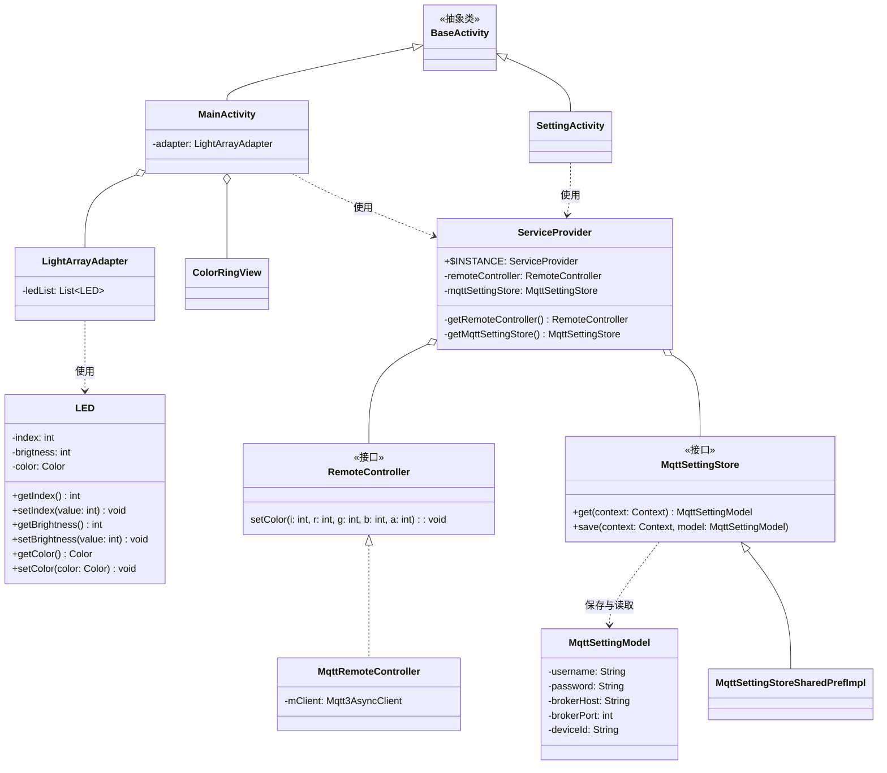

本文是《基于MQTT实现RGB灯远程控制》的第三篇，开发基于mqtt的Android应用，实现RGB灯的远程控制。

# 1. 开发环境准备

要开发安卓应用，我们需要安装最新的android studio开发环境，android studio可以从[官网下载](https://developer.android.google.cn/studio?hl=zh-cn)，中文官网可以畅通无阻的下载，下载链接见文末的引用链接列表。


首次安装的时候，因为需要下载大量的sdk开发环境文件，需要耐心等待安装完成。

# 2. 新建项目

安装好Android Studio后，我们就可以开始开发一个mqtt的应用，打开Android studio，点击**New Project**


我们选择**No Activity**作为项目模版，并填写app的信息：

* Name: 填写app的项目名称
* Package name: 填写app包名
* Save Location: 填写项目保存的目录
* Language: 选择项目开发的语言，本项目使用java作为开发语言
* Minimum SDK: 选择app最低支持的安卓版本
* Build Configuration language: 构建系统的语言，此处选择Groovy


# 3. 项目配置

创建好项目后，我们需要引入一些依赖，因为我们要构建MQTT客户端作为RGB灯的控制端，所以我们需要引入相关的依赖，我们打开**app**目录下的**build.gradle**，并在**dependencies**配置中，增加2个依赖:

* **MQTT客户端**: `com.hivemq:hivemq-mqtt-client`，版本`1.3.10`，hivemq的mqtt客户端仍然支持java语言。
* **JSON库**: 我们使用的是阿里巴巴的fastjson2，版本是`2.0.60.android8`

```groovy
dependencies {
    implementation libs.appcompat
    implementation libs.material
    testImplementation libs.junit
    androidTestImplementation libs.ext.junit
    androidTestImplementation libs.espresso.core

    // mqtt
    implementation libs.hivemq.mqtt.client

    // json
    implementation libs.fastjson2
}
```

```toml
[versions]
...
fastjson2 = "2.0.60.android8"
hivemqMqttClient = "1.3.10"
...

[libraries]
...
# JSON处理依赖库
fastjson2 = { module = "com.alibaba.fastjson2:fastjson2", version.ref = "fastjson2" }
# MQTT依赖库
hivemq-mqtt-client = { module = "com.hivemq:hivemq-mqtt-client", version.ref = "hivemqMqttClient" }
```

添加完依赖后，我们需要使用gradle的sync功能同步并下载相关的依赖。

# APP设计

开始开发前，我们需要对app做一个简单的系统设计。系统类图如下所示:



本app尊序基于面向对象S.O.L.I.D设计理念，将页面与控制逻辑分离，app架构大致可以分为3层：

* `服务接口层`：定义远程控制的接口和数据访问接口，这是连接页面与底层实现的桥梁。
* `服务实现层`：实现服务接口层，例如远程控制采用的是MQTT协议实现，如果后期需要更换控制方式，例如切换为蓝牙控制，我们在无需更改上层代码的情况下，即可轻松切换为其他底层控制实现方法。
* `页面层`：UI页面的实现，用户的交互界面，无需关心底层如何实现具体的控制逻辑。

## 3.1 数据实体

本app定义了两个数据实体，且数据实体贯穿于不同的层：

- `LED`：对LED灯的抽象，包含属性颜色color、编号index、亮度brightness
- `MqttSettingModel`：mqtt连接相关的配置实体

## 3.2 服务接口层

`服务接口层`定义了两个接口，分别是`RemoteController`和`MqttSettingStore`。

* `RemoteController`: 对下位机控制的抽象接口定义，`setColor`定义的是发送rgb灯控制参数的控制函数，控制参数包括:
   - `i`: 控制第几个rgb灯
   - `r`: 红色值(0~255)
   - `g`: 绿色值(0~255)
   - `b`: 蓝色值(0~255)
   - `a`: 亮度值(0~255)
* `MqttSettingStore`: 定义如何读取和保存mqtt连接的参数，分别包括配置的读取`get`和保存`save`。

## 3.3. 服务实现层

服务实现层是实现服务接口层对应的接口:

* `MqttRemoteController`, 实现了`RemoteController`接口，并基于网络MQTT协议实现LED灯的远程控制逻辑。
* `MqttSettingStoreSharedPrefImpl`, 实现了`MqttSettingStore`接口，基于SharedPreferences实现mqtt配置信息的保存。

# 核心代码编写

## MQTT客户端

app的核心就是mqtt的客户端实现，从第一篇理论篇我们学些到，mqtt的连接需要配置如下选项：
* **broker**，mqtt服务器的主机地址，本文我们使用的是emqx的公开broker: `broker.emqx.io`。
* **port**，mqtt服务器的端口，emqx暴露的tcp端口为`1883`。
* **identifier**，表示mqtt的client id，每个连接都必须保证client id的唯一性，我们可以使用一个随机数来充当client id，保证其唯一性。

```java
mClient = MqttClient.builder()
        .addConnectedListener(context1 -> {
          Log.d(TAG, "连接服务器成功");
          if (mOnDeviceConnectionChangedListener != null) {
            mOnDeviceConnectionChangedListener.onConnectionChanged(true);
          }
        })
        .addDisconnectedListener(context2 -> {
          Log.e(TAG, "连接服务器断开");
          if (mOnDeviceConnectionChangedListener != null) {
            mOnDeviceConnectionChangedListener.onConnectionChanged(false);
          }
        })
        .identifier(getClientId())
        .serverHost(options.getBrokerHost())
        .serverPort(options.getBrokerPort())
        .useMqttVersion3()
        .automaticReconnect()
        .applyAutomaticReconnect()
        .buildAsync();
```

# 结语

本篇是《基于MQTT实现RGB灯远程控制》的最后一篇，相信经过这3篇文章的介绍，您对一个物联网控制系统的开发已经有了一个初步的认识。当我们日后有相关的项目需求，我们可以基于这个系列的文章的代码进行扩展以满足我们的项目要求。

更多物联网相关的开发案例，敬请关注公众号: **X驿站**
